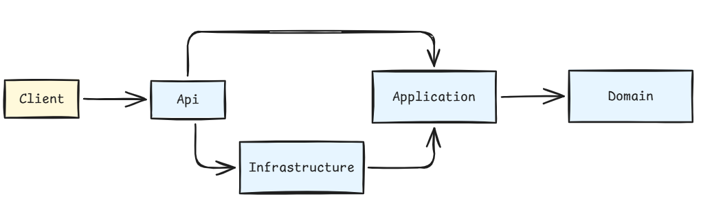

# Adr Unit Tests

Büyük çaplı projelerde *(kurumsal çözümlerde diyebiliriz)* bazı şeylerin garanti altına alınması gerekir. Örneğin uygulamanın mimarisinde geliştirici kaynaklı yapılabilecek bir takım hatalar derleme aşamalarında fark edilmez. Kod bir anda üretim ortamına kadar çıkabilir. Bu tip istenmeyen durumların önüne geçmek için kullanılabilecek farklı yollar var. Kodun kontrollü şekilde çıkartılması için bir review sürecinden geçmesi ve pull request kullanımı bu yöntemlerden birisidir. Ancak birde genel mimariyi etkileyebilecek, statik kod tarama araçları tarafından değerlendirilmeyen hususlar da vardır. Bir katmanın erişmemesi gereken bir katmandan nesne kullanmaya çalışması, geliştirilen bir adaptörün olması gereken katmanda durmaması vb

İşte bu gibi senaryolarda ADR *(Architecture Decision Record)* belgelerince kayıt altına alınan bir takım garantilerin kodun derlenmesi sırasında en azından birim testler yoluyla denetlenmesi çok işe yarar. Özellikle Java dünyasında bu amaçla kullanılan [ArchUnit](https://archunitnet.readthedocs.io/en/stable/) paketleri .Net tarafında da ele alınabilir. Bu repodaki çalışmanın amacı ArcUnitNet kütüphanesinin nasıl kullanıldığına dair bir demo sunmaktır.

## Solution Hakkında

Çözümde çok iddialı bir mimari tasarımı ele almıyoruz. Sadece üzerinde ADR kuralları işleteceğimiz bir solution olması yeterli. Kabaca aşağıdaki bağımlıkların söz konusu olduğunu söyleyebiliriz.

Api çalıştırılabilir giriş noktası ve composition root rolündedir. Application, use case ile repository portlarını içerir. Infrastructure, portların adaptörlerini sağlar. Domain katmanı malum business içerisindeki taban nesneleri taşır ve en önemlisi dış katmanları bilmez *(Business'ı koruma ilkesi)*

Proje referansların yönü aşağıdaki tabloda olduğu gibidir;

| **Proje** | **Referans verdiği uygulama projeleri** |
| --- | --- |
| `OrderManagement.Domain` | Yok |
| `OrderManagement.Application` | `Domain` |
| `OrderManagement.Infrastructure` | `Application` |
| `OrderManagement.Api` | `Application`, `Infrastructure` |
| `OrderManagement.ArchitectureTests` | Dört uygulama projesine de |

Infrastructure, Application üzerinden kullanılan Domain türlerini geçişli referanslarla görebilir. Application katmanının Infrastructure'a referans vermemesi bizim için kritik sınırdır.

## ADR Dokümanları

Projede ele alacağımız ADR dökümanları docs klasörü altında yer alacaktır.
